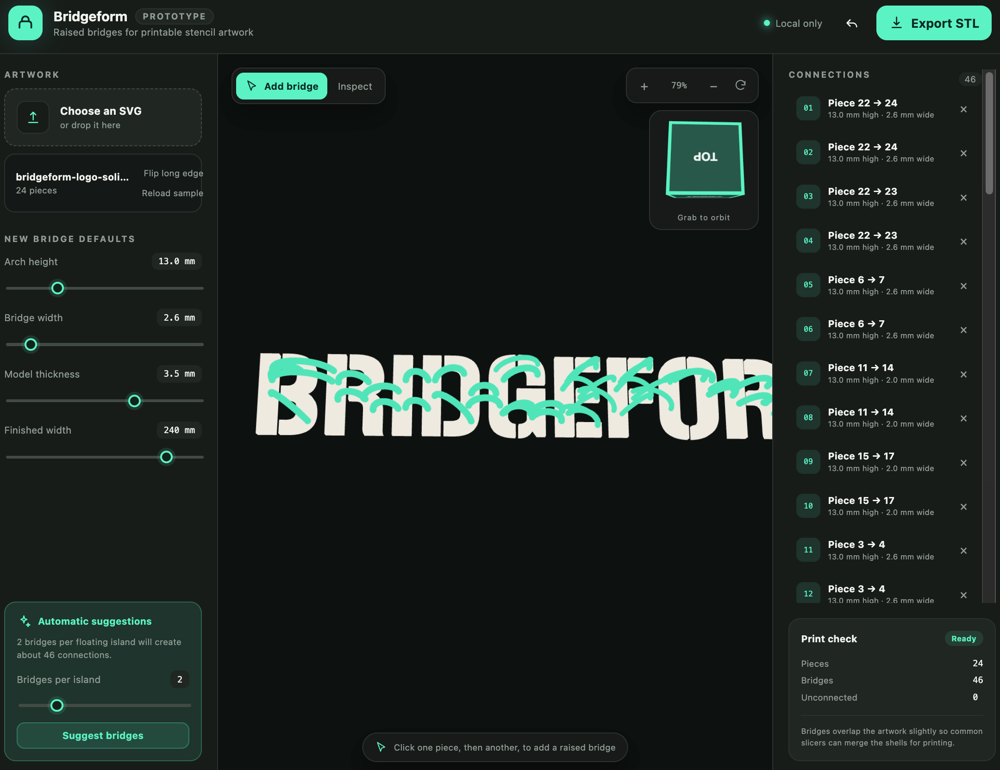
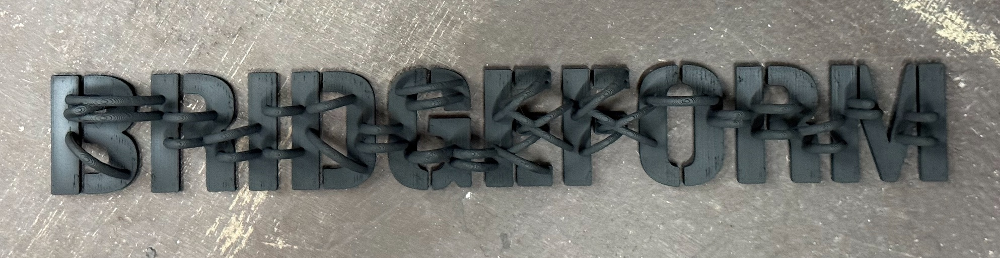
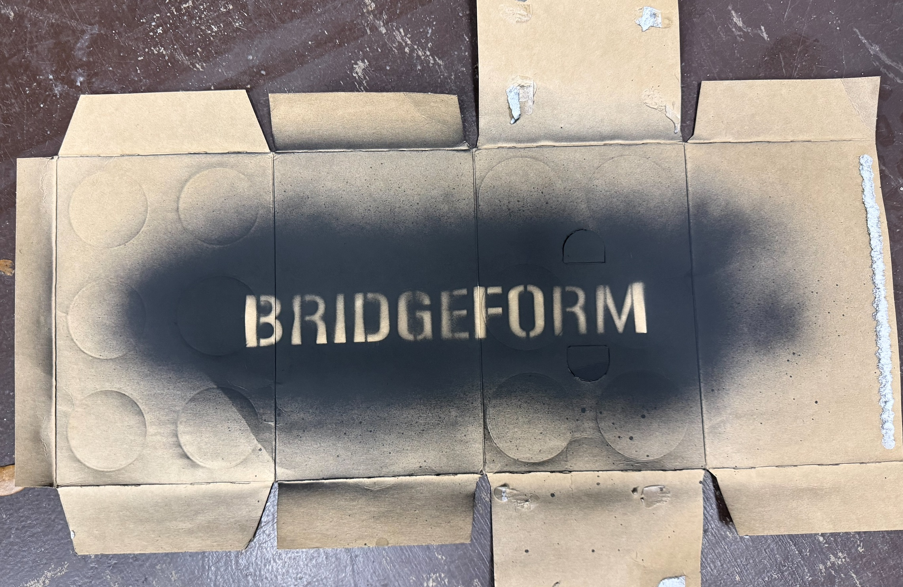

# Bridgeform

Bridgeform is a local browser tool for connecting disconnected SVG artwork with raised, 3D-printable arches, designed for use with spraypaint stencils.

## Example output

Printed Bridgeform stencil:

Spraypaint result:

## Use it in a browser

This repository includes a GitHub Pages workflow. After Pages is enabled with **GitHub Actions** as its source, every push to `main` publishes the working tool. Open the Pages URL shown by the completed **Deploy Bridgeform to GitHub Pages** action.

SVG processing and STL generation happen entirely in the browser. Artwork is not uploaded to a server.

## Run it locally

Double-click `Open Bridgeform.command`. Keep its Terminal window open while using the tool; closing the window stops the local preview.

## How to use Bridgeform

1. Choose or drop an SVG containing filled paths.
2. Choose **Bridges per island**, then click **Suggest bridges**. You can also click one artwork piece and then another to add a bridge manually.
3. Click a bridge in the model or connection list to edit that bridge's height and width. The most recently used values become the defaults for the next manually placed bridge.
4. Adjust artwork thickness and finished width as needed. Finished width scales the artwork and bridge positions only on the horizontal plane; it does not scale bridge diameter or height.
5. Drag the empty background to orbit in either mode. Middle-drag translates the view without rotating, even when starting over the model. Use **Inspect** to orbit from anywhere. Wheel up zooms in and wheel down zooms out. Drag the orientation cube or click one of its six labeled faces for an exact view.
6. When every piece is connected, choose **Export STL**.

SVG text and outline strokes should be converted to filled paths before import. Exported bridges overlap the artwork slightly so common slicers can merge the shells.

## Current boundaries

- Filled SVG paths are supported.
- Automatic placement ranks short candidate connections once, builds a spanning network between the artwork pieces, and prefers horizontally aligned bridges. It falls back to bounded surface sampling when exact horizontal landings cannot fit.
- Suggested bridges anchor to sampled points on the actual filled SVG surfaces. Their endpoint centers move inward by four full tube diameters.
- Bridge width has a 2 mm minimum and is limited by the usable filled area around both endpoints. Automatic placement rejects endpoint pairs that cannot remain embedded in the artwork.
- Arc height is measured upward from the artwork's top surface and supports values up to 50 mm.
- Each bridge uses a circular tube swept along a half-donut-style arch, without enlarged endpoint caps.
- Bridge endpoint faces are parallel to the artwork's top surface.
- Each bridge extends down to the Z=0 build plane at its inset endpoints, creating overlapping volume through the stencil artwork.
- STL export contains intersecting watertight shells rather than performing a Boolean union in the browser.
- Complex transforms, clipping masks, external images, scripts, and embedded styles are intentionally excluded.

## License

Bridgeform is released under the [MIT License](LICENSE). The bundled Three.js files retain their own MIT license notice in `prototype/vendor/THREE-LICENSE.txt`.
